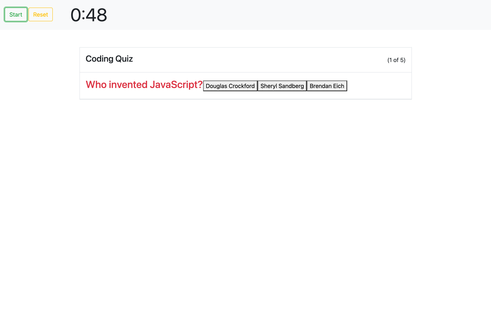

# Coding Quiz

<!-- TABLE OF CONTENTS -->
<details open="open">
  <summary>Table of Contents</summary>
  <ol>
    <li>
      <a href="#about-the-project">About The Project</a>
      <ul>
        <li><a href="#built-with">Built With</a></li>
      </ul>
    </li>
    <li>
      <a href="#getting-started">Getting Started</a>
    </li>
    <li><a href="#code-snippet">Code-Snippet</a></li>
    <li><a href="#license">License</a></li>
    <li><a href="#contact">Contact</a></li>
    <li><a href="#acknowledgements">Acknowledgements</a></li>
  </ol>
</details>


<!-- ABOUT THE PROJECT -->
## About The Project



For this assignment, I had to create a coding quiz from scratch. Nothing was provided, so this was a true test to my knowledge and what I've learned so far. For this quiz, it is timed with a penality for every incorrect answer. Results are shown afterwards and you can reset the quiz to take it again. Of course, making this quiz wasn't easy. It tested my previous knowledge and I was constantly researching to ensure I had the best quiz I could deliver to the user!

The websites I used to help create my generator are listed below in the <a href="#acknowledgements">acknowledgements</a>.

### Built With

I used <a href="https://code.visualstudio.com/">Visual Studio Code</a> to create the HTML, CSS and Javascript from scratch.


<!-- GETTING STARTED -->
## Getting Started

To start the quiz, there will be a start button, when clicked, will initiate the the timer and the first question will appear. You can go to the next problem by pressing the 'next button' and restart the quiz with the 'restart button'.


<!-- USAGE EXAMPLES -->
## Code Snippet

While coding this generator, this piece of code below became the hardest to figure out. I had to create a new function that would calcualte the requested length of the password and display the correct amount. I then used a "for" loop to generatr a password and push the password in the display. The ".join" would display the generated password without commas.

```
function getRandom(arr) {
    var randomIndex = Math.floor(Math.random() * arr.length);
    var element = arr[randomIndex]
    return element
  }

  for (var i = 0; i < passwordLengthUser; i++) {
    var randomChar = getRandom(passwordChar)
    password.push(randomChar)
    console.log(password)
  }
  return password.join("")
```


<!-- LICENSE -->
## License

Distributed under the MIT License. See `LICENSE` for more information.


<!-- CONTACT -->
## Contact

Sami Khawja - Skhawja11@gmail.com

Project Link: [GitHub](https://github.com/samikhawja/coding_quiz)

Live Link: [Password Generator](https://samikhawja.github.io/coding_quiz/)


<!-- ACKNOWLEDGEMENTS -->
## Acknowledgements
* Taylor Hackbart
* [W3Schools](https://www.w3schools.com/)
* [StackOverflow](https://stackoverflow.com/)
* [Mozilla](https://developer.mozilla.org/en-US/docs/Web/JavaScript)